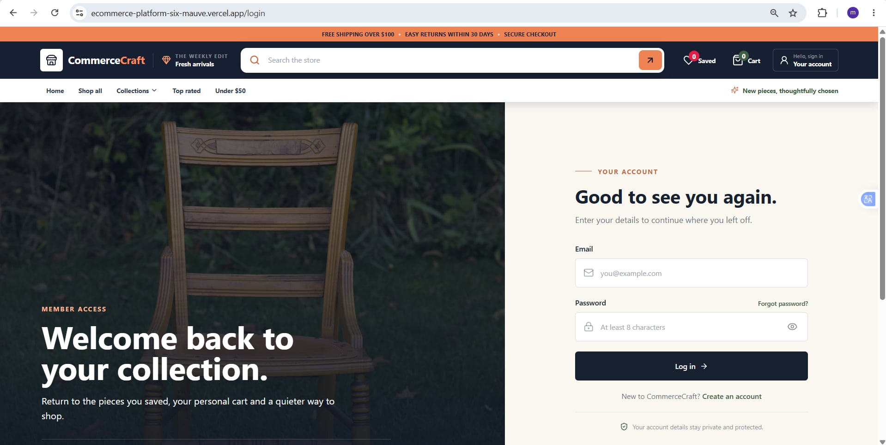
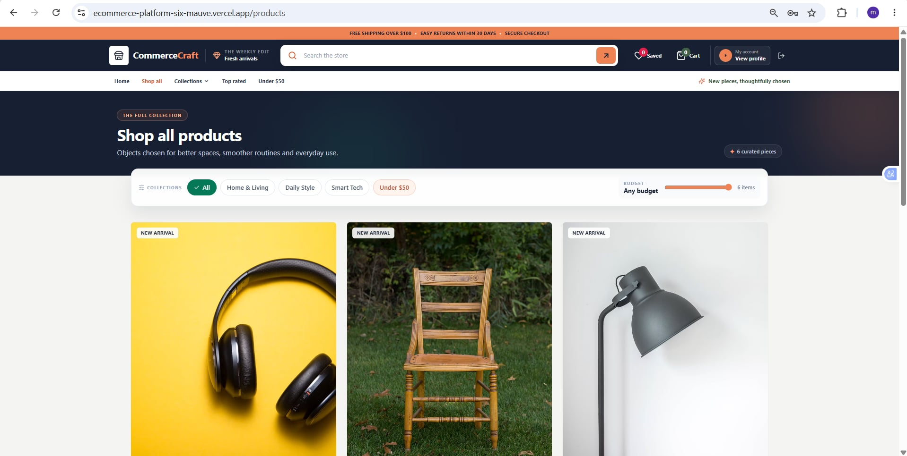
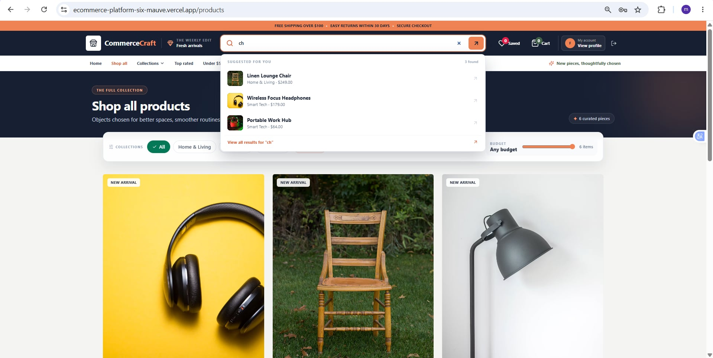
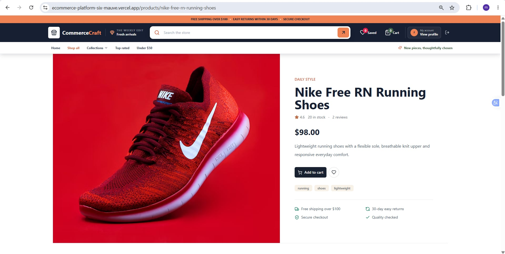
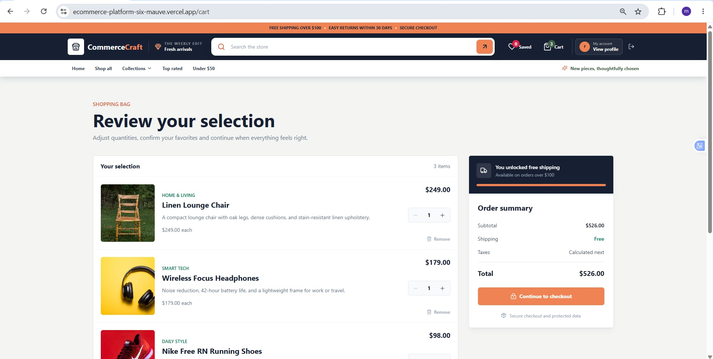
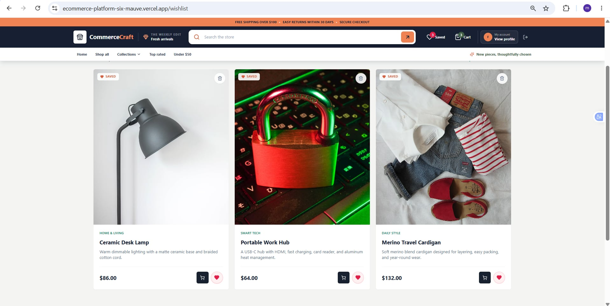
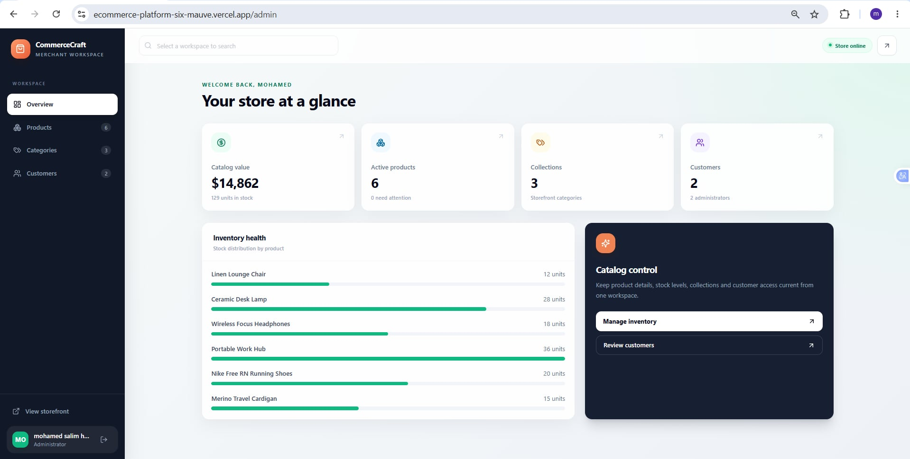

# CommerceCraft

## Project Overview

CommerceCraft is a full-stack e-commerce application. Visitors can browse a catalog, search and filter products, create an account with email verification, manage a cart and wishlist, and access administration features according to their role.

## Features

- Responsive homepage with featured collections and products
- Categories, product catalog, product details, and related products
- Dynamic search, category and price filters, and product sorting
- Registration, login, logout, and signed sessions
- Six-digit email verification before account creation
- Email-based password recovery
- Editable user profile
- Persistent cart with quantity controls, stock validation, and subtotal calculation
- Persistent wishlist with duplicate prevention
- Administrator dashboard for products, categories, and users
- Loading, empty, validation, error, and not-found states

## Technologies Used

### Frontend

- Next.js 15
- React 19
- TypeScript

### Backend

- Next.js Route Handlers
- API Routes
- Server Actions
- Server-side business services

### Database

- AWS DynamoDB
- AWS SDK for JavaScript v3

### Styling

- Tailwind CSS

### Source Control

- Git
- GitHub

## Project Structure

```text
scripts/
  setup-dynamodb.mjs       Table creation and catalog seeding
src/
  app/
    actions/               Server Actions
    api/                   Route Handlers and API endpoints
    ...                    Pages, loading, error, and not-found states
  components/              Reusable UI components
  lib/
    data/                  Catalog seed data
    db/                    DynamoDB client and key definitions
    repositories/          DynamoDB CRUD operations
    services/              Business logic
    api.ts, auth.ts        Authorization and sessions
    env.ts, errors.ts      Configuration and error handling
    mail.ts                Email delivery
    validators.ts          Zod validation schemas
  types/                   Shared types and interfaces
```

## Architecture

```text
User
  -> Next.js application and React UI components
  -> Server pages, Server Actions, and API Route Handlers
  -> Validation and business services
  -> Repositories
  -> AWS DynamoDB
```

UI components never access DynamoDB directly. Services apply business rules, repositories isolate database operations, and shared types and utilities keep application behavior consistent.

## DynamoDB Configuration

The application uses one DynamoDB table named `CommerceCraft`, with `pk` and `sk` as primary key attributes.

| Data | Partition key | Sort key |
| --- | --- | --- |
| User | `USER#{userId}` | `PROFILE` |
| Product | `PRODUCTS` | `PRODUCT#{productId}` |
| Category | `CATEGORIES` | `CATEGORY#{categoryId}` |
| Cart item | `USER#{userId}` | `CART#{productId}` |
| Wishlist item | `USER#{userId}` | `WISHLIST#{productId}` |

Repositories provide read, create, update, and delete operations. Cart and wishlist records are isolated by user. DynamoDB conditional writes prevent duplicate wishlist items.

## Environment Variables

| Variable | Purpose |
| --- | --- |
| `AWS_REGION` | AWS region containing the DynamoDB table |
| `DYNAMODB_TABLE_NAME` | DynamoDB table name |
| `DYNAMODB_ENDPOINT` | Leave unset so local and hosted environments use the shared AWS table |
| `USE_MOCK_DB` | Optional local in-memory storage switch |
| `SESSION_SECRET` | Session cookie signing secret |
| `SMTP_HOST` | SMTP server hostname |
| `SMTP_PORT` | SMTP server port |
| `SMTP_SECURE` | SMTP TLS mode |
| `SMTP_USER` | SMTP account |
| `SMTP_PASS` | SMTP password or app password |
| `MAIL_FROM` | Sender email address |
| `NEXT_PUBLIC_CLOUDINARY_CLOUD_NAME` | Cloudinary cloud name used for image uploads |
| `NEXT_PUBLIC_CLOUDINARY_UPLOAD_PRESET` | Unsigned Cloudinary upload preset used by the admin dashboard |
| `AWS_ACCESS_KEY_ID` | AWS access key for cloud environments |
| `AWS_SECRET_ACCESS_KEY` | AWS secret key for cloud environments |

Secrets are stored in `.env*.local` files or in the hosting provider's secret manager. Local environment files are ignored by Git.

## Installation Instructions

```powershell
npm install
npm test
npm.cmd run dev
```

The local application runs at `http://localhost:3000`. Configure the same AWS DynamoDB table and SMTP variables locally and in Vercel; this keeps accounts, carts, wishlists, password recovery, and reviews consistent across both environments.

## Final Application Screenshots


### Homepage



### Product catalog



### Search suggestions



### Product details



### Shopping cart



### Wishlist



### Administration dashboard


